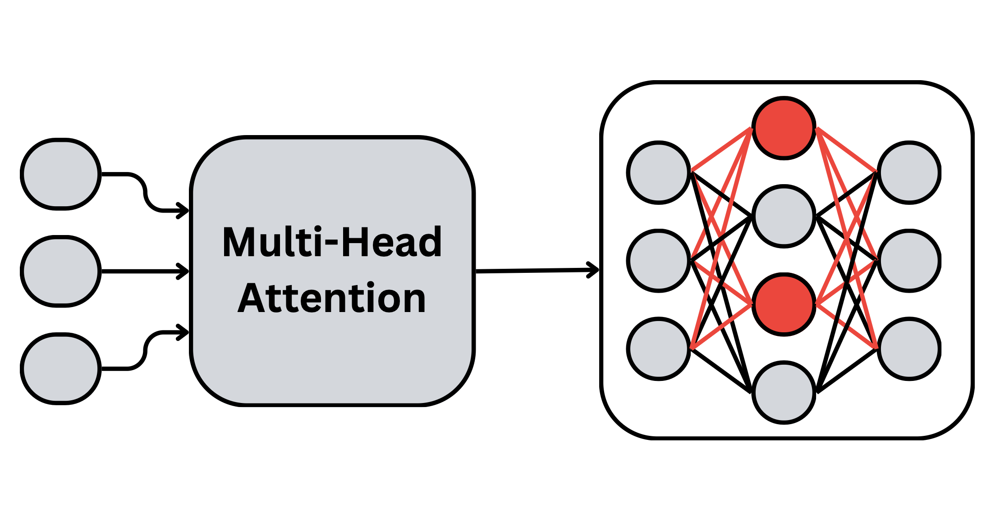

# Sparse Subnetwork Enhancement for Underrepresented Languages

Large language models often perform unevenly across languages, with significant gaps between high- and low-resource ones.  
This repository provides a framework for enhancing **monolingual capabilities in underrepresented languages** while preserving general-purpose performance.  

<p align="center">
  
</p>

Our approach:  
- Identifies **language-specific neurons** using *Language Activation Probability Entropy*.  
- Fine-tunes only the dedicated **language subnetwork** (≤1% of parameters).  
- Outperforms full fine-tuning, MLP-only fine-tuning, LoRA, and random baselines.  
- Demonstrates favorable training dynamics, improved cross-lingual alignment, and efficient adaptation.  

We release:  
- Language-specific neuron identifications for **100+ languages**.  
- A cost-effective **adaptation pipeline** for state-of-the-art models like *Llama-3.1-8B* and *Mistral-Nemo-12B*.  


## Citation

The paper with our results for adapting the above mentioned models to 12 underrepresented languages will be released soon!

If you use this repository, please consider citing:

```bibtex
@misc{gurgurov2025languagearithmeticssystematiclanguage,
      title={Language Arithmetics: Towards Systematic Language Neuron Identification and Manipulation}, 
      author={Daniil Gurgurov and Katharina Trinley and Yusser Al Ghussin and Tanja Baeumel and Josef van Genabith and Simon Ostermann},
      year={2025},
      eprint={2507.22608},
      archivePrefix={arXiv},
      primaryClass={cs.CL},
      url={https://arxiv.org/abs/2507.22608}, 
}

@misc{tang2024languagespecificneuronskeymultilingual,
      title={Language-Specific Neurons: The Key to Multilingual Capabilities in Large Language Models}, 
      author={Tianyi Tang and Wenyang Luo and Haoyang Huang and Dongdong Zhang and Xiaolei Wang and Xin Zhao and Furu Wei and Ji-Rong Wen},
      year={2024},
      eprint={2402.16438},
      archivePrefix={arXiv},
      primaryClass={cs.CL},
      url={https://arxiv.org/abs/2402.16438}, 
}
```
